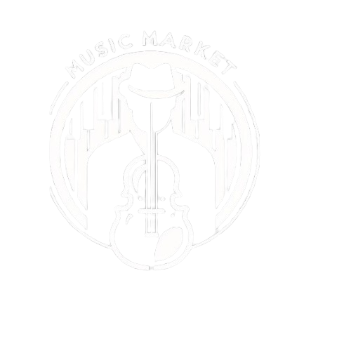

  <h1>Music Market</h1>

<h2>Starting point</h2>
<strong>In the world of music, artists who are dedicated to this profession usually don't have a portfolio to offer their services to potential employers or companies that can hire them.</strong>

 The currency of live events, every day are events that need good musicians and music for their events.
Many times when we are looking for live music for some event(small and big scale), both finds themselves in a problem: 

<ul>
  <li>
    Musicians don´t have a portfolio for their services, showing the music they play
  </li>
  <li>
    Employers and companies don't have any idea of the musician they are hiring when may be better options that fit better your event
  </li>
</ul>

 In <strong>Music Market</strong>, Our objective is to be the connection between musicians and new opportunities to play their music and make themselves known. 
the <strong>Music Market</strong> platform is an opportunity to sell musical services on a small and large scale, where potential contractors can have a reference that will encourage them to hire the services of these musicians who will have their profile on our platform.

<h2>Functionalities:</h2>

 the page will allow entrepreneurs to create their profiles and search for the musical proposal that best fits their search or profile.
 
each businessman or contractor will be able to quote according to the needs he has for his event.
Musicians will have the facility to create a portfolio that will be public on our website and will allow them to connect with potential contractors, small or large events in the music industry.
 
 
On the home page there will be a section containing an initial mosaic cover that will contain a photo of the band or soloist and, when clicked on, will provide information about the type of music and name, inciting and encouraging to quote with this artist. 

<ul>
  <li>creation of user (band or soloist)</li>
  <li>creation of user company or contractor</li>
</ul>

<h3>Companies</h3>

A company or natural person must register the following data to register

<ul>
  <li>ID or company serial name</li>
  <li>name of the company or person</li>
  (since for the moment we will be in Medellin, we will omit the city, and the country)
  <li>e-mail address</li>
  <li>password</li>
</ul>
<h3>Musicians</h3>

Our Most valuable resource for the page are the musicians, because of that, we get the most valuable information about them, to ease the process of the user to find and hire new musicians  

<ul>
  <li></li>
</ul>

  

